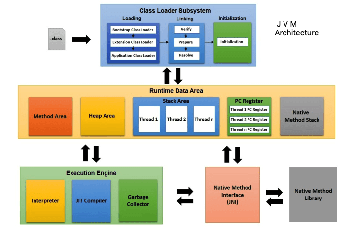

## Java Interview Questions

|No.  |Topic  |
|---------|---------|
|1     |  [JVM](#jvm-architecture--core)       |
|2     |         |
|3     |         |
|4     |         |
|5     |         |
|6     |         |
|7     |         |
|8     |         |
|9     |         |
|10     |         |

## JVM Architecture & Core

### Q. What is a JVM, and how does it work?



Credits: [LinkedIn](https://www.linkedin.com/pulse/jvm-architecture-how-internally-work-ali-as-ad/)

### Q. What are the different components of the JVM?

JVM is generally categorized based on the functionality into the below three components.
>
    ClassLoader
    Runtime Data Area (Memory Area)
    Execution Engine 

### Q. What is a class loader, and how does it work?

A class loader is a component of the Java Virtual Machine (JVM) that loads Java classes into memory at runtime. The JVM uses a hierarchical class loader system to load classes from different sources, such as the local file system or remote servers.

The class loader is responsible for three key tasks:

**Loading**:
The class loader is responsible for locating the bytecode of a class and reading it into memory. It searches for the bytecode in the classpath, which is a list of directories and JAR files where Java classes are stored. If the class has already been loaded, the class loader will simply return the existing class object.

**Linking**: After a class has been loaded, it goes through a linking process that includes three stages: verification, preparation, and resolution. Verification checks that the bytecode is valid and does not violate the Java security model. Preparation allocates memory for static fields and initializes them to default values. Resolution replaces symbolic references with direct references to other classes or methods.

**Initialization**: Finally, the class loader is responsible for initializing the class by executing its static initializer block, which is a block of code that initializes static fields or performs other initialization tasks.

### Q. What are the different class loader?

There are three types of class loaders in Java:

**Bootstrap Class Loader**: It is responsible for loading core Java classes from the \lib\rt.jar file located in the JDK installation directory. It is the parent of all class loaders and is implemented in native code.

**Extension Class Loader**: It is responsible for loading classes from the extensions directory (usually located at jre/lib/ext). It is a child of the Bootstrap Class Loader and is implemented in Java code.

**Application Class Loader**: It is responsible for loading classes from the application classpath. It is a child of the Extension Class Loader and is implemented in Java code.

When a class is requested, the class loader searches for it in its local cache. If the class is not found, it delegates the task to its parent class loader. This process continues until the class is found or the Bootstrap Class Loader is reached.

If none of the class loaders can find the class, a ClassNotFoundException is thrown. Class loaders can also be used to load classes from other sources, such as network locations or databases, by creating custom class loaders.

Class loaders in Java use a delegation model to load classes. Each class loader delegates the task of loading classes to its parent class loader. This ensures that classes are loaded in a hierarchical manner, with higher-level class loaders responsible for loading classes with greater visibility.

### Q. What is bytecode, and how is it executed in the JVM?

Bytecode is a machine-readable code that is generated by compiling a Java source code file. It is a set of instructions that can be executed by the Java Virtual Machine (JVM), which is a program that provides a runtime environment for Java programs.

When a Java source code file is compiled, it is converted into bytecode, which is a platform-independent format. This means that the same bytecode can be executed on any system that has a JVM installed, regardless of the underlying hardware or operating system.

The JVM executes bytecode by first loading the class files containing the bytecode, and then interpreting the bytecode instructions one by one. The interpreter reads the bytecode instructions and executes them by performing the corresponding operations on the JVM.

The JVM also uses Just-In-Time (JIT) compilation to improve performance. When a method is called repeatedly, the JVM can compile the bytecode for that method into native machine code, which can be executed more efficiently than interpreted bytecode. The JVM stores the compiled native code in a cache, so that it can be reused the next time the method is called. This technique is known as "dynamic compilation" or "Just-In-Time compilation".

### Q. What is Just-In-Time (JIT) compilation, and how does it work in the JVM?

Just-In-Time (JIT) compilation is a technique used by the Java Virtual Machine (JVM) to improve the performance of Java programs. When a Java program is executed, the JVM initially interprets the bytecode instructions one by one. However, the interpreter is relatively slow, so the JVM can use JIT compilation to improve performance.

JIT compilation works by dynamically compiling the bytecode instructions into native machine code, which can be executed directly by the CPU. The native code is generated at runtime, and it is specific to the CPU and operating system on which the JVM is running. The JIT compiler identifies sections of the bytecode that are executed frequently and optimizes them by generating native code that can be executed more efficiently than the interpreted bytecode.

The JIT compiler uses a technique called profiling to determine which sections of code should be optimized. When a method is called repeatedly, the JVM can record information about the method's execution, such as the number of times it was called, the parameters passed to it, and the execution time. Based on this information, the JIT compiler can identify the most frequently executed sections of code and optimize them.

The JIT compiler also uses other optimization techniques such as inlining, which involves replacing a method call with the actual code of the method, and loop unrolling, which involves replicating the code inside a loop to reduce the number of iterations. These optimizations can improve the performance of the code by reducing the number of instructions that need to be executed.

### Q. how does JIT code cache affect performance?

The JIT code cache also provides a mechanism for the JVM to manage memory usage. The size of the code cache is limited, and the JVM can evict older or less frequently used compiled code to make room for new code. This helps to prevent the code cache from using too much memory and causing the JVM to slow down or run out of memory.

The size of the JIT code cache can be configured using command-line options when starting the JVM. If the cache is too small, the JVM may have to recompile methods more frequently, which can reduce performance. If the cache is too large, it can use too much memory and cause the JVM to run out of memory.

### Q. How to initiate dynamic class loading and unloading?

Class loading at runtime can be initiated using the Class.forName() method or the ClassLoader.loadClass() method. Here's an example of how to use these methods to load a class dynamically at runtime:

````java
// Using Class.forName()
Class<?> dynamicClass = Class.forName("com.example.DynamicClass");

// Using ClassLoader.loadClass()
ClassLoader classLoader = this.getClass().getClassLoader();
Class<?> dynamicClass = classLoader.loadClass("com.example.DynamicClass");

````

In the first example, the Class.forName() method is used to load the "com.example.DynamicClass" class dynamically at runtime. This method returns a Class object that represents the loaded class.

In the second example, the ClassLoader.loadClass() method is used to load the "com.example.DynamicClass" class dynamically at runtime. This method requires a ClassLoader object, which can be obtained using the getClassLoader() method of any Class object. This method also returns a Class object that represents the loaded class.

Once the class is loaded, you can use it to create instances, call methods, and access fields, just like any other class that was loaded at compile time. For example:

```java
// Create an instance of the dynamic class
Object dynamicObject = dynamicClass.newInstance();

// Call a method on the dynamic object
Method dynamicMethod = dynamicClass.getMethod("dynamicMethod");
dynamicMethod.invoke(dynamicObject);

// Access a field on the dynamic object
Field dynamicField = dynamicClass.getField("dynamicField");
dynamicField.set(dynamicObject, "new value");

```

There is **no explicit way to unload a class manually** from the JVM. Class unloading is managed by the garbage collector, which automatically identifies classes that are no longer needed and frees up the memory used by those classes.

### Q. What is the purpose of the JVM's runtime data area, and different types of memory areas in the JVM?

It is a collection of memory areas where the JVM stores data during program execution.

The runtime data area is divided into five main parts:

* **Program Counter Register**: It is a small area of memory that stores the address of the currently executing JVM instruction.

* **Java Virtual Machine Stack**: It contains frames that hold the method's state, including the method's local variables and its operand stack. Each thread in the JVM has its own stack.

* **Heap**: It is a shared memory area that is used for object allocation. All objects in Java are dynamically allocated from the heap.

* **Method Area**: It is a shared memory area that stores the bytecode of each class, along with the static fields and methods of the class.

* **Runtime Constant Pool**: It is a part of the method area that stores symbolic references to classes, methods, and fields.

These memory areas work together to provide the runtime environment necessary for executing Java programs.

### Q. What is the PermGen space, and how is it different from the Metaspace?

The Permanent Generation (PermGen) was a part of the JVM memory space that was used to store the **class metadata**, **such as the class names**, **method names**, and **field names**, as well as the **bytecode for methods of the loaded classes**. The PermGen space was **a non-heap memory space** that was **allocated at JVM startup**, and its **size was fixed**.

In Java 8 and later versions, the PermGen space has been replaced by the **Metaspace, which is a part of the native memory** and is managed by the operating system. Unlike PermGen, Metaspace is not fixed in size, and **it can dynamically grow or shrink** based on the demand for class metadata. Additionally, the Metaspace has a higher threshold for class metadata, and it can store metadata on the native memory instead of the JVM heap memory, which allows it to use the available memory more efficiently.

The main difference between PermGen and Metaspace is that PermGen was a part of the JVM heap memory, while Metaspace is part of the native memory. The PermGen space had a fixed size, while the Metaspace can dynamically resize itself. Moreover, the Metaspace has better performance and is more efficient in managing class metadata than PermGen.

### Q. What are the different types of memory areas in the JVM, and how are they used?

The different types of memory areas in the JVM:

* **Heap Memory**: The heap memory is a shared memory area that is used to allocate objects at runtime. It is the largest memory area in the JVM, and it is shared by all threads. When an object is created using the new keyword, the JVM allocates memory for the object in the heap memory. The heap memory is divided into two generations: Young Generation and Old Generation.

* **Young Generation**: The Young Generation is a part of the heap memory where newly created objects are stored. It is further divided into Eden Space, Survivor Space 1, and Survivor Space 2. Objects in the Young Generation are short-lived and are frequently garbage-collected.

* **Old Generation**: The Old Generation is a part of the heap memory where long-lived objects are stored. Objects in the Old Generation are not frequently garbage-collected.

* **Method Area**: The Method Area is a part of the JVM memory that stores class-level data, including the bytecode of each class, static fields, method data, and constant pool data.

* **Runtime Constant Pool**: The Runtime Constant Pool is a part of the Method Area that stores symbolic references to classes, methods, and fields.

* **Native Method Stack**: The Native Method Stack is a memory area that stores data for native methods, which are implemented in languages other than Java.

* **PC (Program Counter) Register**: The PC Register is a small memory area that stores the address of the currently executing JVM instruction.

* **JVM Stacks**: Each thread in the JVM has its own stack, which stores the state of the thread, including method data and local variables.

* **Metaspace**: The Metaspace is a memory area introduced in Java 8 to replace the PermGen space. It stores class metadata such as the bytecode, constant pool data, and method data.

### Q. How does the JVM handle method dispatch (i.e., how does it determine which method to call when a method is invoked)?

The JVM (Java Virtual Machine) determines which method to call using a process called method dispatch, which involves the following steps:

* First, the JVM determines the type of the object on which the method is being called. This is called the receiver object.

* The JVM then searches the class hierarchy, starting from the class of the receiver object, and moving up the hierarchy to find the method with the same name and signature as the method being called.

* If the method is found in the class of the receiver object, the JVM calls that method.

* If the method is not found in the class of the receiver object, the JVM looks for the method in the superclass of the receiver object. This process is repeated until the method is found or the root class (Object class) is reached.

* If the method is still not found, the JVM will throw a NoSuchMethodException.

### Q. What is the purpose of the Class file format, and how is it structured?

The Class file format is a binary file format used by the Java Virtual Machine (JVM) to represent compiled Java code. The purpose of the Class file format is to provide a platform-independent way of representing Java code, allowing Java programs to be executed on any platform that has a JVM installed.

The Class file format is structured as follows:

1. **Magic Number**: The first 4 bytes of the file represent a magic number (0xCAFEBABE) that identifies the file as a valid Java class file.

2. **Version Information**: The next 4 bytes represent the minor version and major version numbers of the Java Virtual Machine that can run the class file.

3. **Constant Pool**: The constant pool is a table of constant values used by the class. It contains a variety of data types, including strings, integers, floating-point values, class and interface references, and method references.

4. **Access Flags**: The access flags are used to specify the access level of the class or interface, such as whether it is public or private.

5. **This Class**: The index of the constant pool entry that contains the name of the class or interface being defined.

6. **Super Class**: The index of the constant pool entry that contains the name of the superclass of the class being defined (if any).

7. **Interfaces**: A list of interfaces implemented by the class or interface being defined.

8. **Fields**: A list of fields defined by the class or interface being defined.

9. **Methods**: A list of methods defined by the class or interface being defined.

10 **Attributes**: Additional metadata about the class or interface, such as source code line numbers, debugging information, and annotations.

### Q. What is the difference between a native method and a regular Java method, and how does the JVM handle them differently?

There are several differences between native methods and regular Java methods:

* **Implementation**: Native methods are implemented in a language other than Java, while regular Java methods are implemented in Java.

* **Portability**: Because native methods are implemented in a language other than Java, they are not as portable as regular Java methods. The native code must be compiled for each platform on which it will be run.

* **Performance**: Native methods can be faster than regular Java methods, as they are often implemented in a lower-level language and can take advantage of platform-specific optimizations.

* **Memory management**: Native methods must handle their own memory management, while the Java Virtual Machine (JVM) handles memory management for regular Java methods.

The JVM handles native methods differently than regular Java methods. When a native method is called, the JVM transfers control to the native code, which executes the method. The native code can access system resources and perform operations that are not possible from within Java, such as accessing hardware directly.

Because native methods are not implemented in Java, the JVM uses a different calling convention to invoke them. When a native method is called, the JVM creates a stack frame for the native method and passes control to the native code. When the native code is finished executing, control is passed back to the JVM.

### Q. What is the difference between a static method and an instance method, and how does the JVM handle them differently?

A static method is a method that is associated with a class, while an instance method is a method that is associated with an object (an instance) of the class. Here are the key differences between the two:

* Access: Static methods can be called directly on the class, without the need for an instance of the class, while instance methods can only be called on an instance of the class.

* Memory allocation: Static methods are allocated in memory only once, while instance methods are allocated in memory once per instance of the class.

* Use of class members: Static methods cannot directly access non-static (instance) members of the class, while instance methods can access both static and non-static members of the class.

* Method binding: Static methods are bound to the class at compile time, while instance methods are bound to the instance at runtime.

When it comes to how the JVM handles static and instance methods, there are a few differences:

* Method invocation: Static methods are invoked using the class name, while instance methods are invoked using an instance of the class.

* Memory allocation: Static methods are allocated in a different area of memory (called the method area) than instance methods (which are allocated on the heap).

* Method resolution: The JVM uses different mechanisms to resolve static and instance methods. Static method resolution is done at compile time, while instance method resolution is done at runtime, based on the actual type of the object being used to invoke the method (which can be a subclass of the declared type).

### Q. How does the JVM handle object instantiation, and what is the purpose of the object header?

When you create a new object using the new keyword, the JVM performs the following steps:

    The JVM allocates memory for the object on the heap.
    The JVM initializes the object's fields to their default values.
    The JVM calls the object's constructor to initialize its state.

During the object allocation process, the JVM also creates an object header for the object. The object header is a block of memory that contains metadata about the object, such as its class information, synchronization state, and garbage collection status. The object header is not visible to the Java programmer, but it is an important part of the JVM's internal representation of the object.

The **object header is used for several purposes, including**:

* **Type identification**: The object header contains a reference to the object's class, which allows the JVM to determine the object's type at runtime.
* **Synchronization**: The object header contains a lock that is used for synchronization when multiple threads access the object.
* **Garbage collection**: The object header contains a reference count that is used by the garbage collector to determine when the object can be safely freed.
* **Performance optimizations**: The object header can be used to store additional metadata that is used by the JVM to optimize the performance of the object.

The exact format and contents of the object header may vary depending on the JVM implementation and the platform it is running on.

### Q. What is the difference between static and dynamic linking, and how does the JVM handle both?

Static linking is the process of linking compiled code with external libraries at compile time, before the code is executed. The resulting executable file contains all the necessary code and libraries, so it can be run independently of the operating system. This can result in larger executable files, but it ensures that the code will work on any system without needing the libraries to be installed separately.

Dynamic linking, on the other hand, is the process of linking compiled code with external libraries at runtime, when the code is loaded into memory. The executable file only contains references to the libraries, which are loaded into memory as needed. This can result in smaller executable files, but it requires the libraries to be installed separately and available at runtime.

In the context of the JVM, static and dynamic linking are both used to link compiled Java code to external libraries. However, the JVM typically uses dynamic linking to load external libraries at runtime. When a Java application needs to use a native library, the JVM loads the library dynamically using the system's dynamic linking mechanism. This allows the JVM to load the library only when it is needed, and to unload it when it is no longer needed.

The JVM uses a mechanism called the Java Native Interface (JNI) to bridge the gap between Java code and native code. JNI allows Java code to call functions in native libraries and vice versa. When a Java method that calls a native method is executed, the JVM uses JNI to dynamically load the native library and link the native method with the Java method.

### Q. What is the purpose of the Java Instrumentation API, and how is it used in the JVM?

The Java Instrumentation API is a set of tools and APIs that allow developers to monitor and modify the behavior of Java applications running on the JVM. The primary purpose of the Instrumentation API is to provide a way to dynamically modify the bytecode of Java classes at runtime, without requiring the original source code to be recompiled. This makes it possible to implement a wide range of runtime monitoring and analysis tools, as well as dynamic code generation and profiling.

The Instrumentation API works by providing a way for a Java agent to be loaded into the JVM at runtime, using a command-line option or programmatically. Once loaded, the agent can use the Instrumentation API to register a transformer, which is a class that can modify the bytecode of loaded classes. When a class is loaded or redefined, the JVM invokes the registered transformers, which can modify the bytecode of the class before it is executed.

The Instrumentation API can be used for a wide range of purposes, including:

* **Profiling**: By instrumenting the bytecode of a Java application, it is possible to collect profiling data about the application's performance, such as method execution time, memory usage, and call graphs.

* **Dynamic code generation**: By modifying the bytecode of a class at runtime, it is possible to generate new classes and methods on the fly, which can be used for a variety of purposes, such as implementing custom serialization or adding new functionality to an existing class.

* **Security**: By instrumenting the bytecode of a Java application, it is possible to enforce security policies, such as preventing certain methods from being called or ensuring that sensitive data is encrypted before being transmitted over the network.

* **Debugging**: By instrumenting the bytecode of a Java application, it is possible to add debugging information and tracepoints, which can help to diagnose and fix bugs in the application.

### Q. What are the different types of garbage collectors and How does each garbage collector work ?

The Java Virtual Machine (JVM) uses several different types of garbage collectors to manage memory allocation and garbage collection. Each garbage collector is designed to optimize memory usage and collection for specific use cases. The following are the most common types of garbage collectors:

* **Serial Garbage Collector**: This is the simplest type of garbage collector and is used by default for client-based applications that do not require high performance. The Serial Garbage Collector runs on a single thread, which stops the entire application during the garbage collection process. It is a mark-and-sweep collector, which means it identifies all live objects in the heap and then clears all unused objects.

* **Parallel Garbage Collector**: This garbage collector is similar to the Serial Garbage Collector, except that it uses multiple threads to perform garbage collection. It is a good choice for applications that have high data volume and need faster garbage collection. However, it can still cause long pause times as the entire application must stop while garbage collection is performed.

* **Concurrent Mark Sweep (CMS) Garbage Collector**: The CMS Garbage Collector runs concurrently with the application, meaning that garbage collection can be performed while the application is running. It works by dividing the heap into multiple regions and performing mark-and-sweep on each region. It is suitable for applications that require low pause times and have a high amount of live data.

* **G1 Garbage Collector**: The Garbage First (G1) Collector is designed for large heaps and low-latency applications. It divides the heap into multiple regions and performs garbage collection incrementally on each region. It aims to minimize pause times by targeting the regions that contain the most garbage first.

* **Z Garbage Collector (ZGC)**: The ZGC is a relatively new garbage collector designed for high-throughput, low-latency applications. It works by using a concurrent mark-and-sweep algorithm to identify and reclaim unused objects while the application is running. It is optimized for large heaps and can perform garbage collection without causing significant pause times.

### Q. What are some of the performance tuning options available in the JVM, and how do they work?

### Q. How does the JVM handle exceptions, and what is the role of the exception table?

### Q. What is the purpose of the Java Native Interface (JNI), and how is it used in the JVM?

### Q. What is the difference between a value type and a reference type, and how does the JVM handle them differently?

### Q. How does the JVM handle multi-threading and concurrency?

### Q. What are Wrapper classes and why do we need Wrapper classes in Java?

Wrapper classes in Java are classes that provide a way to use primitive data types (such as int, char, boolean, etc.) as objects. In other words, wrapper classes "wrap" or "encapsulate" primitive data types into objects, allowing them to be treated like objects.

The wrapper classes in Java are:

    Integer
    Double
    Float
    Long
    Short
    Byte
    Character
    Boolean

We need wrapper classes in Java for several reasons:

To enable use of primitive data types in collections: Collections in Java (such as ArrayList, HashSet, etc.) can only store objects, not primitive data types. By using wrapper classes, we can store primitive data types as objects in collections.

To enable use of primitive data types in Generics: Generics in Java (such as List<T>, Set<T>, etc.) can only use objects as type parameters. By using wrapper classes, we can use primitive data types as type parameters.

To provide utility methods: Wrapper classes provide several utility methods for working with primitive data types. For example, the Integer class provides methods for converting strings to integers, and for finding the maximum and minimum values of a set of integers.

To provide synchronization: Wrapper classes are immutable (i.e., their values cannot be changed once they are created), which makes them thread-safe. This makes them useful in multi-threaded applications, where multiple threads may need to access the same data simultaneously.

### How A transient keyword works?

The modifier transient can be applied to field members of a class to turn off serialization on these field members.
You can use transient keyword in classes with fields which need to be secured or calculated on existing state fields. And use it when it simply doesn’t make sense to serialize those fields such as loggers and threads.
Serialization does not care about access modifiers such as private; all non-transient fields are considered part of an object’s persistent state and are eligible for persistence.

### How Volatile keyword works in Java?

“volatile” tells the compiler that the value of a variable must never be cached as its value may change outside of the scope of the program itself.

### Q. What is a compile time constant in Java?

A Java variable is a compile-time constant if it's of a primitive type or String, declared final, initialized within its declaration, and with a constant expression.

Strings are a special case on top of the primitive types because they are immutable and live in a String pool. Therefore, all classes running in an application can share String values.

The term compile-time constants include class constants, but also instance and local variables defined using constant expressions:

The Java compiler statically optimizes all compile-time constants during the compilation process. Therefore, the compiler replaces all compile-time constant references with their actual values. The compiler performs this optimization for any classes where compile-time constants are used.

### Q. Can you have virtual functions in Java?

Java has virtual functions through its support for polymorphism and dynamic method dispatch. In Java, all non-final, non-private methods are considered virtual by default. This means that when a method is invoked on an object, the implementation of the method that is executed depends on the type of the object at runtime.

### Q. What are the restrictions that are applied to the Java static methods?

If a method is declared as static, it is a member of a class rather than belonging to the object of the class. It can be called without creating an object of the class. A static method also has the power to access static data members of the class.

There are a few restrictions imposed on a static method

* The static method cannot use non-static data member or invoke non-static method directly.
* The this and super cannot be used in static context.
* The static method can access only static type data ( static type instance variable ).
* There is no need to create an object of the class to invoke the static method.
* A static method cannot be overridden in a subclass

## OOPS

### Q. What are the oops concepts?

* Class
* Object
* Inheritance
* Polymorphism
* Encpsulation
* Abstraction

More

* Association
* Composition
* Aggregation
* Polymorphic Variables
* Overloading vs. Overriding

### Q. How would you explain a Java Class?

A class is a blueprint or template for creating objects that share a common structure and behavior. It defines a set of properties (also known as instance variables or attributes) and methods that are shared by all objects created from the class.

### Q. How do you explain an object in java?

An object is an instance of a class that has state and behavior.

### Q. How do you explain inheritance?

Inheritance allows programmers to create classes that are built upon existing classes, to specify a new implementation while maintaining the same behaviors (realizing an interface), to reuse code and to independently extend original software via public classes and interfaces.

### Q. What are the types of inheritance in Java?

The types of inheritance in Java are,

1. **Single inheritance**: Single inheritance involves creating a new class that inherits properties and methods from a single parent class. The new class can add additional properties and methods or override existing ones.

2. **Multilevel inheritance**: Multilevel inheritance involves creating a new class that inherits properties and methods from a parent class, which in turn inherits from another parent class. This creates a hierarchy of classes, with each class adding additional properties and methods to the ones inherited from its parent class.

3. **Hierarchical inheritance**: Hierarchical inheritance involves creating multiple child classes that inherit properties and methods from a single parent class. Each child class can add additional properties and methods or override existing ones.

**Multiple inheritance**: Multiple inheritance not supported in Java. but it can be simulated through interfaces.

### Q. What is Polymorphism and what are the types?

Polymorphism is the ability of an object to take on different forms. In Java, polymorphism refers to the ability of a class to provide different implementations of a method, depending on the type of object that is passed to the method.

In Java polymorphism is mainly divided into two types:

* Compile-time Polymorphism
* Runtime Polymorphism

**Compile-time polymorphism**
It is also known as static polymorphism. This type of polymorphism is achieved by function overloading or operator overloading. **Java doesn’t support the Operator Overloading.**

```java
class Helper {
    // Method 1
    // Multiplication of 2 numbers
    static int Multiply(int a, int b) {
        // Return product
        return a * b;
    }
    // Method 2
    // // Multiplication of 3 numbers
    static int Multiply(int a, int b, int c){
        // Return product
        return a * b * c;
    }
}
 
// Class 2
// Main class
class GFG {
    // Main driver method
    public static void main(String[] args){
        // Calling method by passing
        // input as in arguments
        System.out.println(Helper.Multiply(2, 4));
        System.out.println(Helper.Multiply(2, 7, 3));
    }
}
```

```java
8
42
```

**Runtime polymorphism**
It is also known as Dynamic Method Dispatch. It is a process in which a function call to the overridden method is resolved at Runtime. This type of polymorphism is achieved by Method Overriding.

```java
// Class 1
// Helper class
class Parent {
    // Method of parent class
    void Print(){
        // Print statement
        System.out.println("parent class");
    }
}
 
// Class 2
// Helper class
class subclass1 extends Parent {
    // Method
    void Print() { System.out.println("subclass1"); }
}
 
// Class 3
// Helper class
class subclass2 extends Parent {
    // Method
    void Print(){
        // Print statement
        System.out.println("subclass2");
    }
}
 
// Class 4
// Main class
class GFG {
    // Main driver method
    public static void main(String[] args){
        // Creating object of class 1
        Parent a;
        // Now we will be calling print methods
        // inside main() method
        a = new subclass1();
        a.Print();
        a = new subclass2();
        a.Print();
    }
}
```

Output:

```java
subclass1
subclass2
```

### Q. How to achieve Encapsulation in Java?

Encapsulation can be achieved by using access modifiers and creating classes with private data fields and public methods to manipulate those data fields.

Access modifiers are keywords that define the visibility of classes, methods, and data fields. There are four types of access modifiers in Java:

**public** - accessible from anywhere in the program
**private** - only accessible within the same class
**protected** - accessible within the same class and subclasses
**default (no modifier)** - accessible within the same package

### Q. How to achieve Abstraction in Java?

Abstraction can be achieved through the use of abstract classes and interfaces.

An abstract class is a class that cannot be instantiated, meaning you cannot create an object of this class directly. Instead, you must extend this class and provide concrete implementations of its abstract methods in the derived class. Abstract classes can contain both abstract and non-abstract methods, and they are often used to define a common behavior for a group of related classes.

### Q. Explain Association, Aggregation and Composition

**Association**: Association is a simple relationship between two or more classes where they are connected, but they do not depend on each other. In other words, it is a relationship between two independent classes where one class can access the public methods and fields of another class. For example, consider the relationship between a Person class and a Car class. A Person can drive a Car, but the Person class is not dependent on the Car class.

**Aggregation**: Aggregation is a relationship between two classes where one class has a reference to another class, but they can exist independently. In other words, it is a "has-a" relationship where one class contains an object of another class. For example, consider the relationship between a University class and a Student class. A University can have many Students, but the Students can exist independently of the University.

**Composition**: Composition is a relationship between two classes where one class is composed of another class and they cannot exist independently. In other words, it is a "part-of" relationship where one class contains an object of another class, and the contained object cannot exist without the containing object. For example, consider the relationship between a Car class and a Engine class. A Car is composed of an Engine, and the Engine cannot exist independently of the Car.

### Q. Difference between abstract class and interface

|Abstract class  |Interface  |
|---------|---------|
|Abstract class can have abstract and non-abstract methods.     | Interface can have only abstract methods. Since Java 8, it can have default and static methods also.      |
|Abstract class doesn't support multiple inheritance.     |    Interface supports multiple inheritance.     |
|Abstract class can have final, non-final, static and non-static variables.     |    Interface has only static and final variables.     |
|Abstract class can provide the implementation of interface.     |    Interface can't provide the implementation of abstract class.     |
|The abstract keyword is used to declare abstract class.     |     The interface keyword is used to declare interface.    |
|An abstract class can extend another Java class and implement multiple Java interfaces.     |    An interface can extend another Java interface only.     |
|A Java abstract class can have class members like private, protected, etc.     |    Members of a Java interface are public by default.      |

### Q. When to use an Interface and abstract class?

Use an interface when:

* **When you want to support multiple inheritance**: Java does not support multiple inheritance of classes, but it does support multiple inheritance of interfaces. This means that if you have two or more unrelated classes that need to implement a common set of methods, you can define an interface that specifies those methods and have the classes implement that interface. This can be useful when you want to provide a way for unrelated classes to share a common behavior.

* **When you want to define a contract**: Interfaces are often used to define a contract between different parts of a system. For example, you might define an interface for a database access layer that specifies a set of methods for reading and writing data. Any classes that need to interact with the database access layer can then use that interface to ensure that they are interacting with the layer in a consistent way.

* **When you want to provide a way to extend behavior**: Interfaces can be used to define extension points that allow other parts of a system to add functionality. For example, you might define an interface for a plugin system that specifies a set of methods that plugins can implement to add new functionality to the system. Any plugins that are added to the system can then be automatically discovered and used by the main application.

In general, interfaces are best used when you want to define a contract or set of behaviors that can be implemented by unrelated classes or modules, or when you want to provide extension points for other parts of a system.

**Use an abstract class when:**

* **When you want to provide default implementations:** Abstract classes can provide default implementations for methods, while interfaces cannot. This can be useful when you want to provide some common behavior that can be shared by multiple subclasses. For example, you might have an abstract class that provides a default implementation for a particular algorithm, and then have several subclasses that override parts of the algorithm as needed.

* **When you want to share state:** Abstract classes can have instance variables, while interfaces cannot. This can be useful when you want to share state between methods within a class hierarchy. For example, you might have an abstract class that defines a set of instance variables and methods that operate on those variables, and then have several subclasses that use those variables in different ways.

* **When you want to provide a template for subclasses:** Abstract classes can provide a template method pattern, where the abstract class defines a set of steps that should be followed by subclasses, but allows the subclasses to override individual steps as needed. This can be useful when you want to provide a high-level algorithmic structure that can be customized by subclasses. For example, you might have an abstract class that defines a template method for processing a set of data, and then have several subclasses that provide different implementations for processing individual elements of the data.

### Q. What are the rules of method overloading?

* The method name must be the same for all overloaded methods.
* The parameter list must be different for each overloaded method.
* The return type can be different, but it cannot be the only difference between overloaded methods.
* The access level (public, private, protected) can be different for each overloaded method.
* The exceptions thrown can be different for each overloaded method.

### Q. What are the rules of method overriding?

* The method in the subclass must have the same name and parameter list as the method in the superclass.
* The method in the subclass must have the same return type or a subclass of the return type of the method in the superclass. If the return type is a primitive data type, it must be the same as the return type in the superclass.
* The access level of the method in the subclass cannot be more restrictive than the access level of the method in the superclass. For example, if the method in the superclass is declared as public, the method in the subclass must also be declared as public or protected.
* The method in the subclass cannot throw a checked exception that is broader than the exception thrown by the method in the superclass. However, the method in the subclass can throw a narrower exception or an unchecked exception.
* The method in the subclass can use the keyword "super" to call the method in the superclass and then add additional functionality to it.

What are Wrapper classes and why do we need Wrapper classes in Java?

### Q. Explain String Immutablity

Strings in Java are immutable, which means that once a String object is created, its contents cannot be changed. Any operation that appears to modify a String actually creates a new String object with the modified contents, leaving the original String object unchanged.

This immutability property of Strings in Java is enforced through the use of the final keyword on the String class. The final keyword prevents the String object from being subclassed and its methods from being overridden, ensuring that the internal state of the String object remains unchanged.

The immutability of Strings has several benefits, including:

    Thread safety: Since Strings are immutable, they can be safely shared between threads without the need for synchronization.

    Security: Immutable Strings are often used to store sensitive information such as passwords and cryptographic keys because their contents cannot be changed once they are created.

    Performance: Immutable Strings can be safely cached and reused, which can improve performance in certain scenarios.

However, one potential downside of the immutability of Strings is that it can lead to increased memory usage and performance overhead when working with large Strings or performing many String manipulations, as each operation creates a new String object. To mitigate this issue, Java provides the StringBuilder and StringBuffer classes, which provide mutable alternatives to String for situations where frequent modifications to a string are needed.

### Q.What will happen if String is mutable?

* String constant pool will not work
* Security issues can occur.
* Synchronization of string will be an issue.! Need double check on this
* Hashcode Caching will not be valid.
* Performance may be impacted.

### Q. What are the types of interfaces available in Java?

* **Normal interface**: It is a basic interface that has a set of methods that are abstract and public by default.

* **Marker interface**: It is an empty interface that doesn't contain any methods. Its purpose is to signal something to the compiler or runtime system. For example, the Serializable interface is a marker interface that indicates that a class can be serialized.

* **Functional interface**: It is a special type of interface that has only one abstract method. Functional interfaces are used to implement functional programming concepts in Java. They are also used with lambda expressions and method references.

* **Default interface**: It is an interface that contains a default implementation of a method. A default interface method is a method that has a body and provides a default implementation for an interface method. It allows adding new methods to an existing interface without breaking the existing implementations of that interface.

### Q. What is a functional Interface ? what is the need for it?

A functional interface is an interface that contains only one abstract method. It may contain any number of default, static or other methods, but it must have exactly one abstract method. The abstract method can be used as a functional method, meaning that it can be implemented using lambda expressions or method references.

The need for functional interfaces arose due to the introduction of lambda expressions in Java 8. Lambda expressions provide a concise way to represent an instance of a functional interface. Prior to Java 8, to represent an instance of a functional interface, you had to create an anonymous inner class that implemented the interface. This was verbose and made the code difficult to read and maintain.

With functional interfaces, you can use lambda expressions to create implementations of these interfaces in a more concise and readable way. This has made it easier to work with functional programming constructs in Java, such as streams and parallel processing.

In addition to lambda expressions, functional interfaces also enable method references, which allow you to refer to a method by its name rather than by invoking it directly. Method references can be used in many places, such as as arguments to higher-order functions, and allow for even more concise code.

### Q. What is a lambda expression?

A lambda is a set of instructions that can be separated into a separate variable and then repeatedly called in various places of the program.

The basis of the lambda expression is the lambda operator , which represents the arrow ->. This operator divides the lambda expression into two parts: the left side contains a list of expression parameters, and the right actually represents the body of the lambda expression, where all actions are performed.

The lambda expression is not executed by itself, but forms the implementation of the method defined in the functional interface. It is important that the functional interface should contain only one single method without implementation.

In fact, lambda expressions are in some way a shorthand form of internal anonymous classes that were previously used in Java.

**Deferred execution lambda expressions** - it is defined once in one place of the program, it is called if necessary, any number of times and in any place of the program.

### Q. How to pass lambda expression as method parameter?

Example

```java
interface  Condition {
     boolean  isAppropriate ( int  n );
}

private  static  int sum ( int [] numbers, Condition condition) {
     int result =  0 ;
    for ( int i : numbers) {
         if (condition.isAppropriate(i)) {
            result + = i;
        }
    }
    return result;
}

public  static  void main ( String [] args) {
     System.out.println(sum ( new  int [] { 0 , 1 , 0 , 3 , 0 , 5 , 0 , 7 , 0 , 9 }, (n) - > n ! =  0 ));
} 
```

Here `(n) - > n ! =  0 )` is the the lambda expression. It has a single int parameter which matches the `isAppropriate` abstract method in the `Condition` Interface, thus becoming a lambda expression. which can be passed around as an argument to the `sum` method

### Q. Can we initialize final variables inside constructor?

Yes, but the variable should not have been initialized already..

### Q.Whether Java allows super() and this() in same constructor? When super and this will be used use?

This and super cannot be preset in the same constructor.

### Q. What is constructor chaining?

Constructor chaining is a mechanism in Java that allows one constructor to call another constructor in the same class or its parent class. This is useful when you want to reuse code from an existing constructor rather than duplicating it in a new constructor.

In Java, you can chain constructors using the keyword "this" or "super". When you use "this", you call another constructor in the same class, passing the required arguments. When you use "super", you call a constructor in the parent class, passing the required arguments.

### Q. What are the ways to instantiate the Class class?

1. Using new keyword:

```java
MyObject object = new MyObject();
```

2. Using Class.forName():

```java
MyObject object = (MyObject) Class.forName("subin.rnd.MyObject").newInstance();
```

3. Using clone():

```java
MyObject anotherObject = new MyObject();
MyObject object = (MyObject) anotherObject.clone();
```

4. Using object deserialization:

```java
ObjectInputStream inStream = new ObjectInputStream(anInputStream );
MyObject object = (MyObject) inStream.readObject();
```

### Q. what is the effect of final modifier in Java?

The effect of using the final keyword varies depending on where it is used:

**Variables**: When applied to a variable, the final modifier ensures that its value cannot be modified once it has been initialized. This means that the variable becomes a constant and its value cannot be changed throughout the program's execution.

**Methods**: When applied to a method, the final modifier prevents the method from being overridden by subclasses. This means that the method's implementation cannot be changed by any subclass that inherits it.

**Classes**: When applied to a class, the final modifier ensures that the class cannot be subclassed. This means that the class cannot be extended by any other class.

**Parameter**:When a parameter is marked as final, it means that the value of the parameter cannot be changed within the method's body.

### Q. What is covariant return type?

It is possible to have different return type for a overriding method in child class, but child's return type should be sub-type of parent's return type. Overriding method becomes variant with respect to return type. The covariant return type specifies that the return type may vary in the same direction as the subclass.

### Q. How can you avoid serialization in child class if the base class is implementing the Serializable interface?

If superClass has implemented Serializable that means subclass is also Serializable ( as subclass always inherits all features from its parent class ), for avoiding Serialization in sub-class we can define writeObject() method and throw NotSerializableException() from there as done below.

### Q. What is the difference between Serializable and Externalizable interface?

|SERIALIZABLE  |EXTERNALIZABLE  |
|---------|---------|
|Serializable is a marker interface i.e. does not contain any method.     |Externalizable interface contains two methods writeExternal() and readExternal() which implementing classes MUST override.         |
|Serializable interface pass the responsibility of serialization to JVM and it's default algorithm.     |Externalizable provides control of serialization logic to programmer – to write custom logic.         |
|Mostly, default serialization is easy to implement, but has higher performance cost.     |Serialization done using Externalizable, add more responsibility to programmer but often result in better performance.         |
|It's hard to analyze and modify class structure because any change may break the serialization.     |It's more easy to analyze and modify class structure because of complete control over serialization logic.         |
|Default serialization does not call any class constructor.     |A public no-arg constructor is required while using Externalizable interface.         |

### Q. Can you declare an interface method static?

Java 8 interface changes include static methods and default methods in interfaces. Prior to Java 8, we could have only method declarations in the interfaces. But from Java 8, we can have default methods and static methods in the interfaces.

### Q. What are default interface methods?

Java 8 allows you to add non-abstract method implementations to an interface using the keyword default:

* If a class implements an interface, it can, but does not have to, implement the default methods already implemented in the * interface. The class inherits the default implementation.
* If a class implements several interfaces that have the same default method, then the class must implement the method with the same signature on its own. The situation is similar if one interface has a default method, and in the other the same method is abstract - no class default implementation is inherited.
* The default method cannot override the class method java.lang.Object.
* They help implement interfaces without fear of disrupting other classes.
* Avoid creating utility classes, since all the necessary methods can be represented in the interfaces themselves.
* They give classes the freedom to choose the method to be redefined.
* One of the main reasons for introducing default methods is the ability of collections in Java 8 to use lambda expressions.

### Q. What is static interface method?

Static interface methods are similar to default methods, except that there is no way to override them in classes that implement the interface.

* Static methods in the interface are part of the interface without the ability to use them for objects of the implementation class
* Class methods java.lang.Objectcannot be overridden as static
* Static methods in the interface are used to provide helper methods, for example, checking for null, sorting collections, etc.

## Exception

### Q. What is the need for finally block?

The finally block is used to define a block of code that will be executed regardless of whether an exception is thrown or not. The finally block is typically used to perform cleanup operations or to release resources that were acquired in a try block.

Here are some of the key reasons for using a finally block:

**Guaranteed execution**: The finally block is guaranteed to execute, even if an exception is thrown or if the control is transferred out of the try block using a return, break, or continue statement.

**Cleanup operations**: The finally block can be used to perform cleanup operations, such as releasing resources like files, network connections, or database connections, that were acquired in the try block.

**Consistent state**: By using the finally block to perform cleanup operations, we can ensure that the program is left in a consistent state, even if an exception is thrown.

### In what scenarios is code in finally not executed?

The code inside a finally block is usually executed regardless of whether an exception is thrown or not. However, there are some scenarios in which the code in the finally block might not be executed, including:

    When the program terminates abnormally: If the program is terminated abnormally, for example, due to a power outage or hardware failure, the finally block may not be executed.

    When the System.exit() method is called: If the System.exit() method is called, the JVM will immediately stop execution of the program, and the finally block will not be executed.

    When the thread running the code in the finally block is interrupted: If the thread running the finally block is interrupted, either by calling the Thread.interrupt() method or because an interrupt signal was sent to the thread, the finally block may not be executed.

    When the finally block contains an infinite loop or blocks indefinitely: If the finally block contains an infinite loop or blocks indefinitely, the program will never exit the finally block, and the code following the finally block will not be executed.

### Q. Is try without a catch is allowed?

Yes, It is possible to have a try block without a catch block by using a final block.

### Q. Is try without catch and finally allowed?

No, It is not possible to have a try block without catch or finally. either catch or finally has to be used.

### Q. Can you explain the hierarchy of exception handling classes?

The java.lang.Throwable class is the root class of Java Exception hierarchy inherited by two subclasses: Exception and Error. The hierarchy of Java Exception classes is given below:


### What is the difference between error and exception?

Both errors and exceptions are types of Throwable objects, but they are used to represent different types of problems that can occur during program execution.

An Error in Java represents a severe, unrecoverable problem that typically indicates a serious issue with the system or environment in which the program is running. Examples of Error include OutOfMemoryError, StackOverflowError, and LinkageError. When an Error occurs, it usually means that the program cannot continue executing and should terminate.

On the other hand, an Exception in Java represents a problem that can be handled or recovered from within the program's logic. There are two types of exceptions in Java: checked and unchecked. Checked exceptions are those that are checked at compile time and must be handled or declared in a method's signature. Examples of checked exceptions include IOException and SQLException. Unchecked exceptions are those that are not checked at compile time and can be handled or not at runtime. Examples of unchecked exceptions include NullPointerException and ArrayIndexOutOfBoundsException.

### What is the difference between checked exceptions and unchecked exceptions?

Exceptions are classified into two categories: checked exceptions and unchecked exceptions. The main difference between these two categories of exceptions is how they are handled by the compiler and the programmer.

**Checked exceptions** are those that **are checked at compile time** and must be either handled using a try-catch block or declared in the method signature using the throws keyword. Examples of checked exceptions include IOException, SQLException, and ClassNotFoundException. The purpose of checked exceptions is to ensure that the programmer handles potential exceptions that may occur during program execution.

**Unchecked exceptions**, on the other hand, are **not checked at compile time** and can be thrown at runtime without the need for explicit handling. Examples of unchecked exceptions include NullPointerException, ArrayIndexOutOfBoundsException, and IllegalArgumentException. Unchecked exceptions can occur due to programming errors such as incorrect array indices, null pointer dereferences, or passing an invalid argument to a method. Unchecked exceptions are not required to be caught or declared using the throws keyword.

In summary, checked exceptions are those that are checked at compile time and must be handled or declared, while unchecked exceptions are not checked at compile time and can be thrown at runtime without the need for explicit handling. The distinction between checked and unchecked exceptions helps to ensure that exceptions are properly handled by the programmer, while also allowing for more flexibility and simplicity in exception handling in certain cases.

### Q.What is the difference between throws , throw and throable?

Throws, throw, and Throwable are related concepts, but they are used in different ways to handle and propagate exceptions during program execution.

**Throwable is a superclass of all errors and exceptions** in Java, and it is used to represent any type of problem that can occur during program execution. Throwable has two subclasses: Error and Exception. Error represents a severe, unrecoverable problem that usually indicates a problem with the system or environment, while Exception represents a problem that can be handled or recovered from within the program's logic.

**throw is a keyword used in Java to explicitly throw an exception**. When an exception is thrown using the throw keyword, control is immediately transferred to the nearest try-catch block that can handle the exception.

**throws is a keyword used in Java to declare that a method may throw a particular type of exception**. When a method declares that it throws an exception, it means that the method may throw that exception during its execution, and the caller of the method must either handle the exception or declare that it throws the exception as well.

### Q. How does try with resources work?

Java's "try-with-resources" statement is a language feature that was introduced in Java 7 to simplify resource management and ensure that resources are properly closed or released when they are no longer needed.

In traditional try-catch-finally blocks, resources like file handles, database connections, or network sockets must be explicitly closed in the finally block to ensure that they are properly released, even if an exception occurs. This can be cumbersome and error-prone, especially when dealing with multiple resources.

With the try-with-resources statement, resources are automatically closed when the try block exits, either normally or due to an exception. This is achieved by declaring the resource as a local variable in the try statement, enclosed in parentheses after the try keyword. The resource must implement the AutoCloseable interface, which provides a close() method that is called when the resource is no longer needed.

### Q. What is difference between ClassNotFoundException and NoClassDefFoundError?

ClassNotFoundException and NoClassDefFoundError occur when a particular class is not found at runtime. However, they occur at different scenarios.

ClassNotFoundException is an exception that occurs when you try to load a class at run time using Class.forName() or loadClass() methods and mentioned classes are not found in the classpath.

NoClassDefFoundError is an error that occurs when a particular class is present at compile time, but was missing at run time.

## Generics

### Q. What are Generics in Java?

Generics in Java is a feature that allows types (classes and interfaces) to be parameterized. It provides a way to write code that is reusable, type-safe, and can work with different types.

The main idea behind generics is to provide a way to define a type that can be used with different types of objects, without having to create separate implementations for each type. With generics, a single implementation can be used with different types of objects, as long as those objects are of the same type or a subtype of that type.

For example, let's say you have a class called Box that represents a box that can hold an object of any type. Without generics, you would have to define Box as follows:

```java
public class Box {
    private Object object;

    public void set(Object object) { this.object = object; }
    public Object get() { return object; }
}
```

Here, Object is used as a placeholder for any type of object. However, this implementation has a major drawback: since the get() method returns an Object, you would need to cast it to the correct type before using it, which can be unsafe.

With generics, you can parameterize the Box class so that it can hold an object of any type, but the type is known at compile time. Here's how you could define Box using generics:

```java
public class Box<T> {
    private T object;

    public void set(T object) { this.object = object; }
    public T get() { return object; }
}
```

Here, T is a placeholder for the type of object that the Box can hold. The set() and get() methods now work with objects of type T. When you create an instance of Box, you specify the type of object that it can hold:

## Miscellaneous

### Q. How will you invoke any external process in Java?

In java, external process can be invoked using exec() method of Runtime Class.

```java
        try { 
            // Command to create an external process 
             String command = "C:\\Program Files (x86)\\Google\\Chrome\\Application\\chrome.exe"; 
  
            // Running the above command 
            Runtime run  = Runtime.getRuntime(); 
            Process proc = run.exec(command); 
        } catch (IOException e) { 
            e.printStackTrace(); 
        }
```

### Q. What is an immutable object? How to make an object immutable?

Immutable objects are objects that don't change. A Java immutable object must have all its fields be internal, private final fields. It must not implement any setters. It needs a constructor that takes a value for every single field.

Creating an Immutable Object:

* Do not add any setter method
* Declare all fields final and private
* If a field is a mutable object create defensive copies of it for getter methods
* If a mutable object passed to the constructor must be assigned to a field create a defensive copy of it
* Don't allow subclasses to override methods.

### Q. What is the difference between creating String as new() and literal?

When you create String object using new() operator, it always create a new object in heap memory. On the other hand, if you create object using String literal syntax e.g. "Java", it may return an existing object from String pool ( a cache of String object in Perm gen space, which is now moved to heap space in recent Java release ), if it's already exists. Otherwise it will create a new string object and put in string pool for future re-use.

### Q. What is difference between String, StringBuffer and StringBuilder?

1. Mutability Difference:

String is immutable, if you try to alter their values, another object gets created, whereas StringBuffer and StringBuilder are mutable so they can change their values.

2. Thread-Safety Difference:

The difference between StringBuffer and StringBuilder is that StringBuffer is thread-safe. So when the application needs to be run only in a single thread then it is better to use StringBuilder. StringBuilder is more efficient than StringBuffer.

### Q. What is Java Reflection API?

Reflection API in Java is used to manipulate class and its members which include fields, methods, constructor, etc. at runtime.

The java.lang.Class class provides many methods that can be used to get metadata, examine and change the run time behavior of a class. There are 3 ways to get the instance of Class class.

    forName() method of Class class
    getClass() method of Object class
    the .class syntax

### What is Stream in Java?

A stream is a sequence of data elements that can be processed in a pipeline fashion. Streams are a feature of Java 8 and later versions and provide a concise and functional way of processing collections of data.

The key idea behind streams is to process data in a declarative manner, where you specify the desired result and let the Java runtime handle the details of how to achieve it. This allows for efficient, parallel processing of large data sets.

In Java, streams are implemented using the Stream interface and its various methods. You can create a stream from a collection or an array using the stream() method, and then use various stream methods to transform, filter, and aggregate the data as needed. For example, you might use map() to transform each element in the stream, filter() to remove elements that don't meet a certain criteria, and reduce() to combine elements in the stream into a single value.

Streams are a powerful and flexible feature of Java, and can be used to process a wide variety of data sets efficiently and concisely.

A stream can have any number of calls to intermediate operations and the last call to the final operation. At the same time, all intermediate operations are performed lazily and until the final operation is called, no actions actually happen (similar to creating an object Threador Runnable, without a call start()).

Streams are created based on sources of some, for example, classes from java.util.Collection.

Associative arrays (maps), for example HashMap, are not supported.

Operations on streams can be performed both sequentially and in parallel.

Streams cannot be reused. As soon as some final operation has been called, the flow is closed.

### Q. What is fail-fast and fail-safe with respect to iterators in java?

"fail fast" and "fail-safe" are two different approaches to handling errors and exceptions in programs.

**Fail-fast**: This approach is used in Java collections, and it means that if any modification is made to a collection while it is being iterated, a ConcurrentModificationException is immediately thrown. This is done to prevent errors that can occur if multiple threads modify the same collection at the same time.

Fail-fast behavior is generally considered to be safer because it catches errors early, preventing further damage to the program.

**Fail-safe**: This approach is used in some algorithms and data structures to handle errors and exceptions in a way that doesn't cause the program to crash. Instead of immediately throwing an exception, a fail-safe system will try to continue processing the data, even if some errors occur.

For example, in a concurrent hash map, if multiple threads try to modify the same key at the same time, a fail-safe approach would ensure that the data in the map is still consistent and the program continues to run, even if some data is lost or corrupted.

The advantage of fail-safe is that it allows the program to continue running even when errors occur, but it can also lead to data inconsistencies or other unexpected behavior.

### Q.What is the difference between statically typed and dynamically typed languages?

* Statically typed programming languages do type checking (i.e. the process of verifying and enforcing the constraints of types) at compile-time as opposed to run-time.
* Dynamically typed programming languages do type checking at run-time as opposed to compile-time.

### Q.How is an overloaded method chosen when a parameter is the literal null value?, what will happen if method is overloaded with String , Object , Number and a StringBuilder?

    The informal intuition is that one method is more specific than another if any invocation handled by the first method could be passed on to the other one without a compile-time type error.

In case if methods are overloaded with StringBuilder and String, and null argument is passed in the function call. Both methods are still applicable, because neither String nor StringBuffer is more specific than the other, The compiler will throw an error.

### Q. When are the static inner classes called?

In Java, the static inner class is loaded at the same time as its containing class, and is available for use as soon as the containing class is initialized.

Static inner classes are loaded during the class loading phase, which is typically when the JVM first encounters the class file. During this phase, the JVM reads in the byte code for the class and performs various initialization tasks, including initializing static fields and loading any static inner classes.

It's worth noting that while you don't need to create objects of a static inner class to use it, creating objects of the inner class can be a useful technique in some situations. For example, you might use an object of a static inner class to encapsulate a specific set of functionality, or to implement a specific interface or abstract class.


## Thread

### Q. What are the two ways of creating thread in Java?

There are basically two ways of implementing thread in java as given below: 

* Extending the Thread class
* Implementing Runnable interface in Java

### Q. Explain thread lifecycle


### Q. What’s the difference between class lock and object lock?

**Class Lock**: In java, each and every class has a unique lock usually referred to as a class level lock. These locks are achieved using the keyword ‘static synchronized’ and can be used to make static data thread-safe. It is generally used when one wants to prevent multiple threads from entering a synchronized block. 

Use a class-level lock when you need to synchronize access to a shared resource that is accessed by multiple instances of a class. 
For example, if you have a static method that modifies a static variable, you can synchronize the method using the class-level.

**Object Lock**: In java, each and every object has a unique lock usually referred to as an object-level lock. These locks are achieved using the keyword ‘synchronized’ and can be used to protect non-static data. It is generally used when one wants to synchronize a non-static method or block so that only the thread will be able to execute the code block on a given instance of the class.  

### Q. What is the difference between synchronization at method level and synchronization at block level in java?

Synchronization at method level is achieved by using the `synchronized` keyword in the method declaration. When a thread invokes a synchronized method, it acquires the lock of the object that the method is invoked on. This means that no other thread can invoke any synchronized method of the same object until the first thread releases the lock.

Synchronization at block level is achieved by using the `synchronized` keyword on a block of code. In this case, the lock is acquired on a specific object that is specified in the synchronized keyword. This means that no other thread can enter any synchronized block that uses the same object as a lock until the first thread releases the lock.

The main difference between synchronization at method level and synchronization at block level is the granularity of the lock. With synchronization at method level, the lock is acquired on the entire method, which means that other synchronized methods of the same object cannot be invoked by other threads. With synchronization at block level, the lock is acquired only on the specific block of code that uses the specified object as a lock, which allows more fine-grained control over synchronization.

Another difference is that with synchronization at block level, you can use different objects as locks for different blocks of code, which allows more flexibility in controlling access to shared resources.

### Q. what happens if a synchronized method is static?

When a static method is called with the syntax ClassName.methodName(), the method is invoked on the class itself, rather than on an instance of the class. In this case, the object associated with the class is used as the lock for synchronization purposes.

The object associated with a class is an instance of the Class class, which is created by the JVM when the class is loaded into memory. This object is a singleton instance, which means that only one instance of it is created per class, regardless of how many instances of the class are created.

When a synchronized static method is called using the ClassName.methodName() syntax, the lock obtained by the thread is on the class object (i.e., the singleton instance of the Class class associated with the class). This means that only one thread can execute any synchronized static method of the class at a time, even if multiple threads are calling the method on different instances of the class.

It's worth noting that using the ClassName.methodName() syntax to call a static method is equivalent to calling the method on a null object reference, as the method is not associated with any specific instance of the class. Therefore, if a static method attempts to access an instance variable, it will result in a compile-time error, as there is no instance to access.

### Q. What's the difference between User thread and Daemon thread?

User and Daemon are basically two types of thread used in Java by using a ‘Thread Class’.  


|User Thread  |Daemon Thread   |
|---------|---------|
|JVM waits for user threads to finish their tasks before termination.      |JVM does not wait for daemon threads to finish their tasks before termination.       |
|These threads are normally created by the user for executing tasks concurrently.      | These threads are normally created by JVM.       |
|They are used for critical tasks or core work of an application.      |They are not used for any critical tasks but to do some supporting tasks.         |
|These threads are referred to as high-priority tasks, therefore are required for running in the foreground.      |  These threads are referred to as low priority threads, therefore are especially required for supporting background tasks like garbage collection, releasing memory of unused objects, etc.        |
| has higher prority     | if cpu cycles are full the deamon threads are given the least priority        |

### Q. What are the wait() and sleep() methods?

wait(): As the name suggests, it is a non-static method that causes the current thread to wait and go to sleep until some other threads call the notify () or notifyAll() method for the object’s monitor (lock). It simply releases the lock and is mostly used for inter-thread communication. It is defined in the object class, and should only be called from a synchronized context. 
sleep(): As the name suggests, it is a static method that pauses or stops the execution of the current thread for some specified period. It doesn’t release the lock while waiting and is mostly used to introduce pause on execution. It is defined in thread class, and no need to call from a synchronized context.  

### What is Runnable and Callable Interface? Write the difference between them. 

Both the interfaces are generally used to encapsulate tasks that are needed to be executed by another thread. But there are some differences between them as given below: 

Running Interface: This interface is basically available in Java right from the beginning. It is simply used to execute code on a concurrent thread.  
Callable Interface: This interface is basically a new one that was introduced as a part of the concurrency package. It addresses the limitation of runnable interfaces along with some major changes like generics, enum, static imports, variable argument method, etc. It uses generics to define the return type of object.

|Runnable Interface |Callable Interface |
|---------|---------|
|It does not return any result and therefore, cannot throw a checked exception. |It returns a result and therefore, can throw an exception.|
|It cannot be passed to invokeAll method. |It can be passed to invokeAll method.|
|It was introduced in JDK 1.0. |It was introduced in JDK 5.0, so one cannot use it before Java 5.  |
|It simply belongs to Java.lang. |It simply belongs to java.util.concurrent. |
|It uses the run() method to define a task.| It uses the call() method to define a task. |
|To use this interface, one needs to override the run() method.| To use this interface, one needs to override the call() method.|

### What’s the purpose of the join() method?

join() method is generally used to pause the execution of a current thread unless and until the specified thread on which join is called is dead or completed. To stop a thread from running until another thread gets ended, this method can be used. It joins the start of a thread execution to the end of another thread’s execution. It is considered the final method of a thread class.

### Explain the meaning of the deadlock and when it can occur?

A thread deadlock occurs when two or more threads are blocked, waiting for each other to release a lock or a resource that they need to continue their execution. In other words, each thread is holding a lock or a resource that the other thread needs, but neither thread can proceed until the other thread releases the lock or the resource. Here is an example scenario that can lead to a thread deadlock:

Suppose we have two threads, T1 and T2, that need to access two shared resources, R1 and R2, to perform their tasks. The threads require both resources in a specific order: T1 needs to acquire R1 first, and then R2, while T2 needs to acquire R2 first, and then R1. Here's a possible sequence of events that can lead to a deadlock:

1. T1 acquires lock on R1.
2. T2 acquires lock on R2.
3. T1 tries to acquire lock on R2 but is blocked because T2 is holding the lock on R2.
4. T2 tries to acquire lock on R1 but is blocked because T1 is holding the lock on R1.
5. Both threads are now blocked, waiting for the other to release the lock on the resource they need.

At this point, a deadlock has occurred, and neither thread can proceed. They are both waiting for the other thread to release the lock on the resource they need, but neither thread will release their lock until they have acquired the other resource first. This situation can lead to a deadlock, where both threads are stuck indefinitely, waiting for each other to release the resources they need.

To avoid thread deadlocks, it's important to ensure that threads always acquire locks on shared resources in a consistent order, and to release locks as soon as they are no longer needed. It's also important to avoid holding locks for too long, as this can increase the likelihood of thread contention and deadlock.

### what is a racecondition in thread? how to avoid it?

A race condition is a situation in which the behavior of a program depends on the relative timing of events or actions executed by multiple threads. In other words, it occurs when two or more threads access shared resources concurrently, and the final outcome of the program depends on the order in which the threads execute.

A typical example of a race condition is when multiple threads try to update a shared variable simultaneously. If the threads are not synchronized properly, the final value of the variable may not be what was expected, as the order in which the threads execute may affect the final result.

To avoid race conditions in multi-threaded programs, you can use several techniques, including:

**Synchronization**: By using locks or other synchronization mechanisms, you can ensure that only one thread at a time can access a shared resource. This can help prevent race conditions by enforcing a specific order of execution for the threads.

**Atomic operations**: Atomic operations are operations that are executed as a single, indivisible unit. By using atomic operations instead of standard operations, you can ensure that multiple threads can access a shared resource without interfering with each other.

**Thread-safe data structures**: Thread-safe data structures are designed to be accessed concurrently by multiple threads without the risk of race conditions. These data structures provide internal synchronization mechanisms to ensure that only one thread can access them at a time.

**Avoid shared state**: One of the best ways to avoid race conditions is to avoid sharing state between threads altogether. By using message passing or other mechanisms to communicate between threads, you can ensure that each thread operates on its own copy of the data, without interfering with the others.

**Design for concurrency**: When designing multi-threaded programs, it's important to consider the potential for race conditions from the beginning. By designing your program to minimize shared state and maximize concurrency, you can reduce the risk of race conditions and make your program more scalable and efficient.

### Q.What is priority of a thread? How do you change the priority of a thread?

The priority of a thread is a value that determines how much CPU time the thread should receive relative to other threads in the same process. Threads with higher priority values are given preference over threads with lower priority values, and the scheduler will allocate more CPU time to higher priority threads.

In Java, thread priority is represented by an integer value between 1 and 10, where 1 is the lowest priority and 10 is the highest priority. The default priority for a thread is 5.

To change the priority of a thread in Java, you can use the setPriority method of the Thread class. The setPriority method takes an integer value between 1 and 10 as its argument

### Q.What is yield method in thread? how does it work?

The yield() method is a method in Java's Thread class that is used to give a hint to the scheduler that the current thread is willing to yield its current use of the CPU to allow other threads to run. Essentially, calling the yield() method indicates that the current thread is not doing anything particularly important and that other threads may take priority in execution.

When the yield() method is called, the current thread enters the yielding state and the scheduler determines which thread should run next. If there are other threads with the same or higher priority than the yielding thread, one of them will be selected to run, while the yielding thread will continue to be eligible for execution. If there are no other threads with the same or higher priority, the yielding thread will continue to run.

### Q. what is CompletableFuture?

A CompltableFuture is used for asynchronous programming. It runs a task on a separate thread than the main application thread and notifies the main thread about its progress, completion or failure.

Sometimes you need to wait for all CompletableFuture calls to complete and only then to run some other task. `allOf` method in completable future helps us to achieve it.

### Q. What is an ExecutorService ? how it works?

The Java ExecutorService is the interface which allows us to execute tasks on threads asynchronously. The Java ExecutorService interface is present in the java.util.concurrent package. The ExecutorService helps in maintaining a pool of threads and assigns them tasks. It also provides the facility to queue up tasks until there is a free thread available if the number of tasks is more than the threads available.


## Collections

### Explain the collection Hierarchy.

[References.](https://www.falkhausen.de/Java-8/java.util/Collection-List.html)


